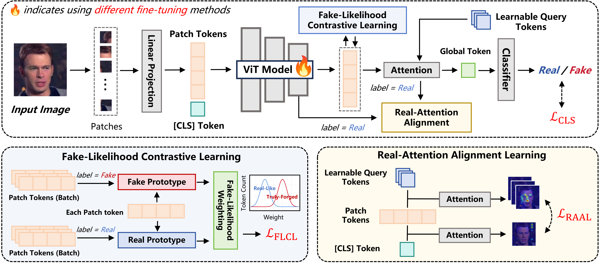

# Beyond [CLS] Token: Query-Driven Token-Level Forgery Purification for Generalizable Deepfake Detection

### [CVPR 2026] 

**Authors:** Changshuo Wang, Jiangming Wang, Ke-Yue Zhang, Taiping Yao, Shunli Wang, Shouhong Ding, Ran Yi, Lizhuang Ma  
**Institution:** Shanghai Jiao Tong University (SJTU)

---

## 📢 News
* **[2026-03]** Our paper has been accepted by **CVPR 2026**! 
* **[2026-03]** We have released the project repository. Code and models are coming soon.

---

## 💡 Abstract
We investigate state-of-the-art deepfake detectors that leverage ViT-based vision foundation models and discover that the [CLS] token suffers from the Pre-trained Information Bias (PIB), i.e., it tends to mainly focus on global semantics due to the knowledge dominated by pre-trained model parameters, while struggling to emphasize subtle local forgery cues. To overcome this limitation, one potential way is incorporating the token-level features to reform a new detection-specific token. To this end, we propose Query-Driven Token-Level Forgery Purification (QTFP) framework to better capture local forgery traces without losing useful pre-trained prior. Specifically, we first introduce randomly initialized, learnable query tokens independent of the backbone and prior knowledge, which can effectively aggregate multi-patch evidence into a global token for detection. To make query tokens focus on meaningful regions, we propose a theoretical fake-likelihood contrastive learning loss, which employs a weighting strategy to highlight significant fake regions while diminishing the impact of real-like patches. Using SNR theory, we verify that the designed weight is both reliable and informative. To further maintain useful authentic information, a real-attention alignment constraint is applied to query tokens. These designs go beyond relying solely on the [CLS] token by jointly reorganizing real and fake information across all tokens, which successfully enhance detector robustness. Extensive experiments on diverse datasets demonstrate the effectiveness of our method.
---

## 🛠️ Methodology

*Figure 1: Overview of the QTFP framework. We use learnable query tokens to identify and purify forged regions at the token level.*


---

## 📜 Citation
If you find our work useful, please cite:

```bibtex
@inproceedings{wang2026qtfp,
  title={Beyond [CLS] Token: Query-Driven Token-Level Forgery Purification for Generalizable Deepfake Detection},
  author={Changshuo, Wang and Jiangming, Wang and Ke-Yue, Zhang and Taiping, Yao and Shunli, Wang and Shouhong, Ding and Ran, Yi and Lizhuang, Ma},
  booktitle={CVPR},
  year={2026}
}
